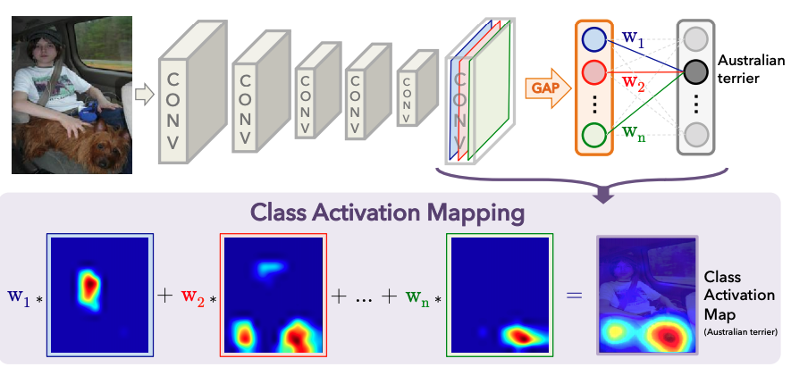

## Tensorflow implementation of Learning Deep Features for Discriminative Localization"

Model will be trained on ILSVRC 2014 dataset

### Paper review/ introduction

The paper introduces a way to implement object loacalization without using annotated
data or data with bounding boxes and is based on the idea that units become more and more
discriminative as the depth of the n/w increases.

For the example implementation, I will be using VGG16 net after clipping its FC layers.

#### Related concepts:
##### 1.  Class Activation Mapping
A class activation map for a particular category indicates the discriminative image regions
used by the CNN to identify the category. 
##### 2. Global Average Pooling
In here in this case, we take the average of all the elements of a unit of last conv output.

Note: Why GAP and not GMP?   
GAP loss encourages the network to identify the extent of the object whereas GMP encourages
the network to identify just one discriminative part.

Thick architecture: 

